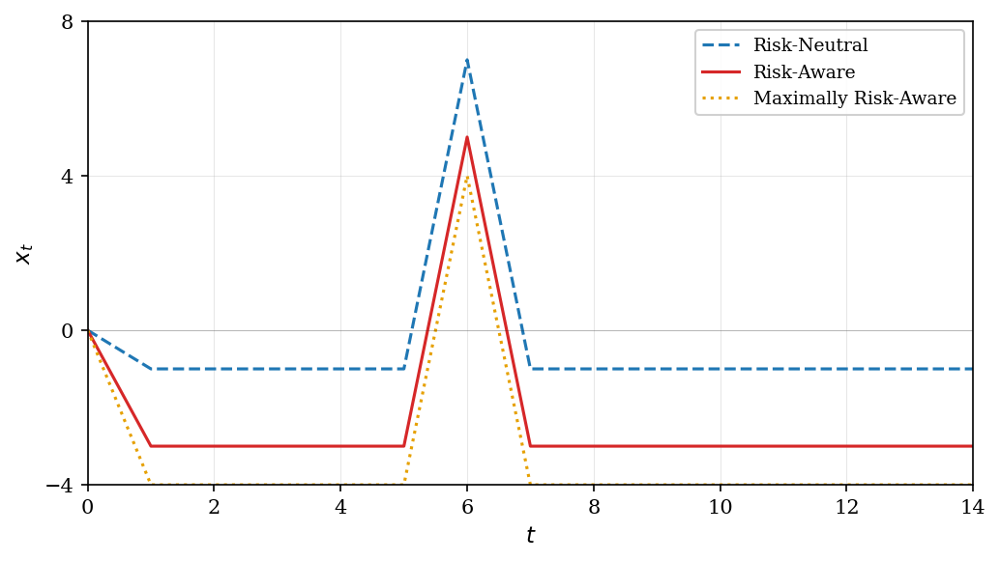
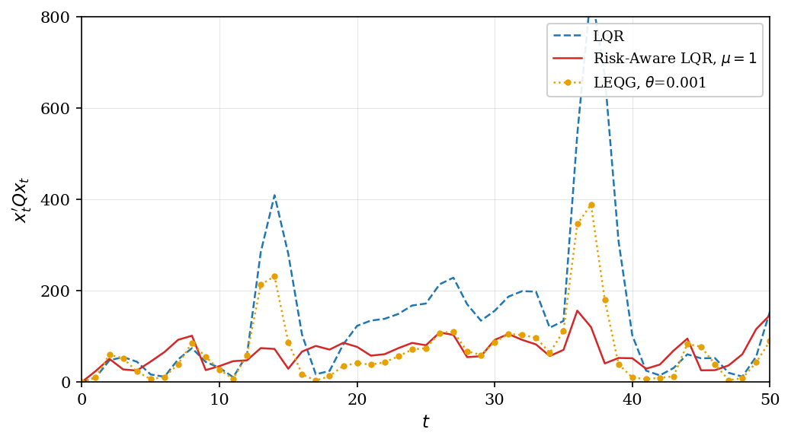
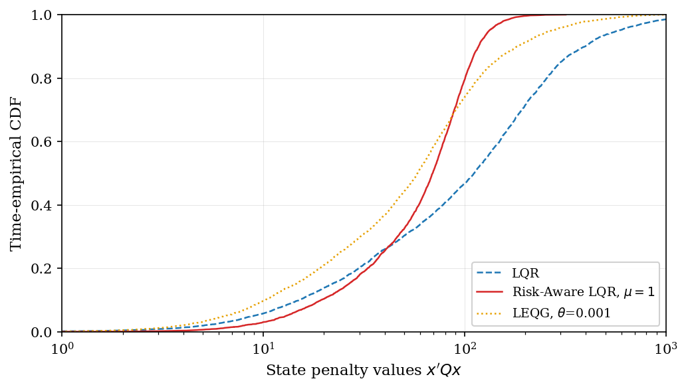
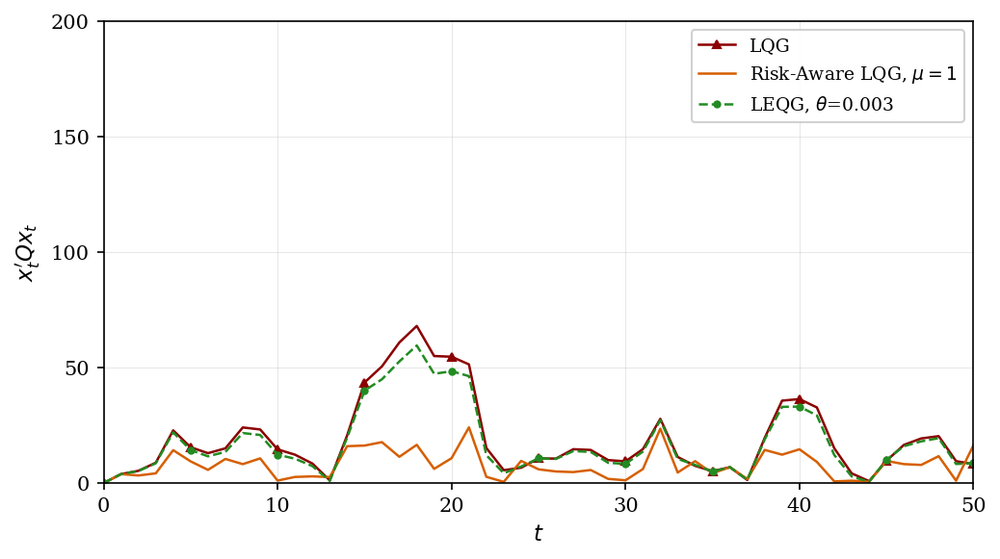
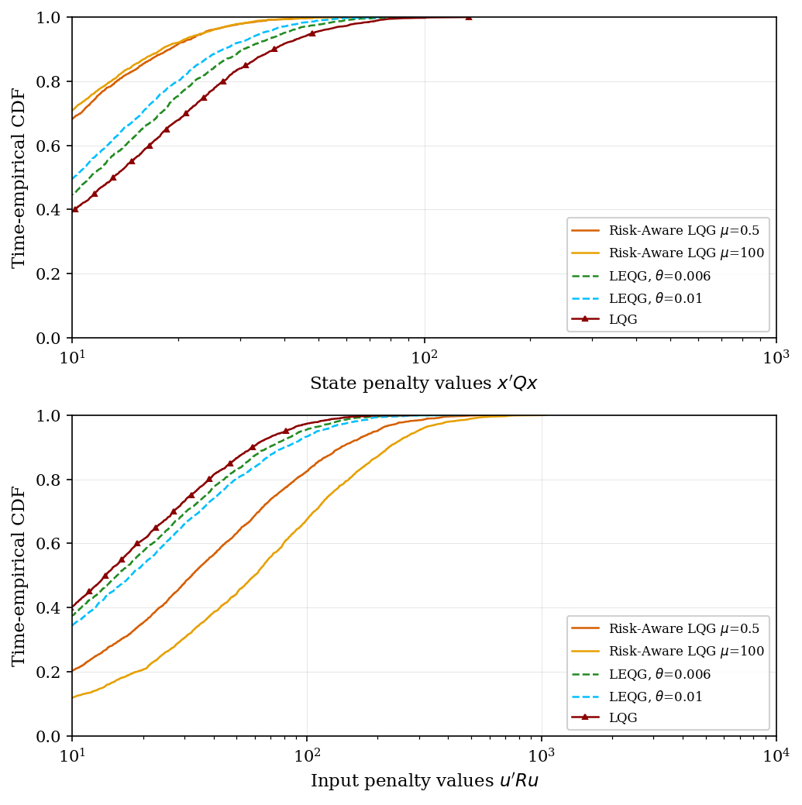

# Risk-Aware Linear Quadratic Control

Implementation of the risk-constrained LQR and LQG controllers from:

> A. Tsiamis, D. S. Kalogerias, A. Ribeiro, and G. J. Pappas, "Linear Quadratic Control with Risk Constraints," *IEEE Transactions on Automatic Control*, 2023.

## Problem Formulation

Consider a discrete-time linear system:

$$\mathbf{x}_{t+1} = \mathbf{A} \mathbf{x}_t + \mathbf{B} \mathbf{u}_t + \mathbf{w}_{t+1}$$

$$\mathbf{y}_t = \mathbf{C} \mathbf{x}_t + \mathbf{v}_t$$

where $\mathbf{x}_t \in \mathbb{R}^n$ is the state, $\mathbf{u}_t \in \mathbb{R}^p$ is the control input, $\mathbf{y}_t \in \mathbb{R}^m$ is the measurement, and $\mathbf{w}_t, \mathbf{v}_t$ are process and measurement noise.

The standard LQ cost minimizes expected cumulative cost:

$$\min_{\mathbf{u}} \mathbb{E} \left[ \mathbf{x}_N^\top \mathbf{Q} \mathbf{x}_N + \sum_{t=0}^{N-1} \mathbf{x}_t^\top \mathbf{Q} \mathbf{x}_t + \mathbf{u}_t^\top \mathbf{R} \mathbf{u}_t \right]$$

This risk-neutral formulation optimizes average performance but may be ineffective under infrequent yet significant extreme events (e.g., large wind gusts, sudden disturbances).

### Risk-Constrained Formulation

To explicitly limit tail risk, the paper introduces a predictive variance constraint:

$$\min_{\mathbf{u}} \mathbb{E} \left[ \mathbf{x}_N^\top \mathbf{Q} \mathbf{x}_N + \sum_{t=0}^{N-1} \mathbf{x}_t^\top \mathbf{Q} \mathbf{x}_t + \mathbf{u}_t^\top \mathbf{R} \mathbf{u}_t \right]$$

$$\text{s.t.} \quad \mathbb{E} \left[ \sum_{t=1}^{N} \left( \mathbf{x}_t^\top \mathbf{Q} \mathbf{x}_t - \mathbb{E}[\mathbf{x}_t^\top \mathbf{Q} \mathbf{x}_t \mid \mathcal{F}_{t-1}] \right)^2 \right] \leq \epsilon$$

where $\mathcal{F}_{t-1}$ is the $\sigma$-algebra generated by all observables up to time $t-1$. The constraint bounds the cumulative expected predictive variance of the state penalty, forcing the controller to account for higher-order noise statistics.

## Mathematical Details

### Noise Statistics

For process noise with innovation $\boldsymbol{\delta}_t = \mathbf{w}_t - \bar{\mathbf{w}}$, the relevant statistics are:

- **Covariance**: $\mathbf{W} = \mathbb{E}[\boldsymbol{\delta}_t \boldsymbol{\delta}_t^\top]$
- **Third moment** (skewness): $\mathbf{m}_3 = 2\mathbf{Q} \mathbb{E}[\boldsymbol{\delta}_t \boldsymbol{\delta}_t^\top \mathbf{Q} \boldsymbol{\delta}_t]$
- **Fourth moment**: $m_4 = \mathbb{E}\left[\left(\boldsymbol{\delta}_t^\top \mathbf{Q} \boldsymbol{\delta}_t - \operatorname{tr}(\mathbf{Q}\mathbf{W})\right)^2\right]$

The third moment $\mathbf{m}_3$ captures asymmetry in the noise distribution. For Gaussian noise, $\mathbf{m}_3 = \mathbf{0}$.

### Risk-Aware LQR (Fully Observed Systems)

Using Lagrangian duality with multiplier $\mu \geq 0$, the optimal control law is (Theorem 3):

$$\mathbf{u}_t^* = \mathbf{K}_t \mathbf{x}_t + \mathbf{l}_t$$

where the gain $\mathbf{K}_t$ satisfies a Riccati equation with **inflated** state penalty:

$$\mathbf{Q}_\mu = \mathbf{Q} + 4\mu \mathbf{Q} \mathbf{W} \mathbf{Q}$$

The Riccati recursion (backward in time):

$$\mathbf{V}_{t-1} = \mathbf{A}^\top \mathbf{V}_t \mathbf{A} + \mathbf{Q}_\mu - \mathbf{A}^\top \mathbf{V}_t \mathbf{B} (\mathbf{B}^\top \mathbf{V}_t \mathbf{B} + \mathbf{R})^{-1} \mathbf{B}^\top \mathbf{V}_t \mathbf{A}$$

$$\mathbf{K}_{t-1} = -(\mathbf{B}^\top \mathbf{V}_t \mathbf{B} + \mathbf{R})^{-1} \mathbf{B}^\top \mathbf{V}_t \mathbf{A}$$

with terminal condition

$$\mathbf{V}_N = \mathbf{Q}_\mu$$

The affine term $\mathbf{l}_t$ accounts for noise mean and skewness:

$$\boldsymbol{\xi}_{t-1} = (\mathbf{A} + \mathbf{B}\mathbf{K}_{t-1})^\top (\boldsymbol{\xi}_t + \mathbf{V}_t \bar{\mathbf{w}}) + \mu \mathbf{m}_3$$

$$\mathbf{l}_{t-1} = -(\mathbf{B}^\top \mathbf{V}_t \mathbf{B} + \mathbf{R})^{-1} \mathbf{B}^\top (\boldsymbol{\xi}_t + \mathbf{V}_t \bar{\mathbf{w}})$$

with terminal condition

$$\boldsymbol{\xi}_N = \mu \mathbf{m}_3$$

**Interpretation:**

1. The term $4\mu \mathbf{Q} \mathbf{W} \mathbf{Q}$ in the inflated cost penalizes state directions where both the cost $\mathbf{Q}$ and noise covariance $\mathbf{W}$ are large simultaneously.

2. The affine term $\mathbf{l}_t$ pushes the state away from directions where the noise has heavy tails (captured by $\mathbf{m}_3$).

3. As $\mu \to 0$, we recover risk-neutral LQR. As $\mu \to \infty$, the controller becomes maximally risk-aware, treating noise as adversarial.

### Risk-Aware LQG (Partially Observed Systems)

For Gaussian noise with partial observations (Theorem 7), the optimal control law is:

$$\mathbf{u}_t^* = \mathbf{K}_t \hat{\mathbf{x}}_{t|t} + \mathbf{l}_t$$

where $\hat{\mathbf{x}}_{t|t}$ is the Kalman filter estimate. The time-varying inflated cost is:

$$\mathbf{Q}_{\mu,t} = \mathbf{Q} + 4\mu \mathbf{Q} \mathbf{W}_t \mathbf{Q}$$

where $\mathbf{W}_t$ is the Kalman filter prediction error covariance:

$$\mathbf{W}_{t+1} = \mathbf{A} \mathbf{W}_t \mathbf{A}^\top + \mathbf{W} - \mathbf{A} \mathbf{W}_t \mathbf{C}^\top (\mathbf{C} \mathbf{W}_t \mathbf{C}^\top + \mathbf{S})^{-1} \mathbf{C} \mathbf{W}_t \mathbf{A}^\top$$

The Riccati equation becomes (backward):

$$\mathbf{V}_{t-1} = (\mathbf{A} + \mathbf{B}\mathbf{K}_t)^\top \mathbf{V}_t (\mathbf{A} + \mathbf{B}\mathbf{K}_t) + \mathbf{K}_t^\top \mathbf{R} \mathbf{K}_t + \mathbf{Q}_{\mu,t-1}$$

Unlike risk-neutral LQG, the control design depends on the estimation process (no certainty equivalence). However, separation still holds: the optimal estimator remains the minimum mean-square error Kalman filter.

For Gaussian noise, $\mathbf{m}_3 = \mathbf{0}$, so there is no affine term. Risk awareness is achieved purely through the inflated gain.

### Comparison with LEQG

The Linear Exponential Quadratic Gaussian (LEQG) controller minimizes:

$$\mathbb{E}\left[ \exp\left(\theta \sum_{t} \mathbf{x}_t^\top \mathbf{Q} \mathbf{x}_t + \mathbf{u}_t^\top \mathbf{R} \mathbf{u}_t \right) \right]$$

LEQG has two limitations addressed by this approach:

1. **Well-posedness**: LEQG requires the moment generating function to exist, excluding heavy-tailed distributions. The predictive variance approach only requires finite fourth moments.

2. **Stability**: LEQG can become unstable near the "neurotic breakdown" point where $\theta$ is too large. The risk-aware LQR/LQG controllers remain stable for all $\mu \geq 0$.

## Example: Flying Robot with Wind Disturbance

The simulations model a robot moving on a 2D plane as a double integrator:

$$\mathbf{x}_{k+1} = \begin{bmatrix} 1 & T_s & 0 & 0 \\ 0 & 1 & 0 & 0 \\ 0 & 0 & 1 & T_s \\ 0 & 0 & 0 & 1 \end{bmatrix} \mathbf{x}_k + \begin{bmatrix} T_s^2/2 & 0 \\ T_s & 0 \\ 0 & T_s^2/2 \\ 0 & T_s \end{bmatrix} (\mathbf{u}_k + \mathbf{d}_k)$$

where $\mathbf{d}_k$ is wind disturbance. The wind model has:
- Strong direction: bimodal mixture of $\mathcal{N}(30, 30)$ (80%) and $\mathcal{N}(80, 60)$ (20%)
- Weak direction: $\mathcal{N}(0, 5)$

This models infrequent but large wind gusts.

## Results

### LQR with Bimodal Wind

The risk-aware controller ($\mu = 1$):
- Achieves lower average and maximum state penalties than risk-neutral LQR
- Pushes the state away from the direction of large gusts
- Uses more control effort to regulate risky directions more strictly



*Figure 1: Response to a rare shock at time 6. Risk-aware controllers pre-compensate, limiting peak deviation.*



*Figure 2: Evolution of state penalties. Risk-aware LQR limits variability during wind gusts.*



*Figure 3: Time-empirical CDF. Risk-aware LQR significantly reduces probability of large penalties.*

### LQG with Gaussian Noise

For partially observed systems with Gaussian noise:
- Risk-aware LQG regulates the state more strictly than LQG
- Increasing $\mu$ reduces state penalties at the cost of increased control effort
- LEQG shows similar behavior for small $\theta$ but becomes poorly behaved near the neurotic breakdown point



*Figure 5: LQG state penalty evolution. Risk-aware controller achieves tighter regulation.*



*Figure 6: Trade-off curves. Risk-aware LQG offers a wider, more intuitive range of risk-performance trade-offs than LEQG.*

## Usage

```python
import numpy as np
from risk_aware_lqr import (
    SystemParams, 
    RiskAwareLQR, 
    RiskNeutralLQR,
    compute_noise_statistics
)

# Define system
A = np.array([[1, 0.5], [0, 1]])
B = np.array([[0.125], [0.5]])
Q = np.eye(2)
R = np.array([[1]])

sys = SystemParams(A=A, B=B, Q=Q, R=R)

# Generate noise samples and compute statistics
noise_samples = np.random.randn(10000, 2) @ np.array([[1, 0], [0.5, 0.5]])
noise_stats = compute_noise_statistics(noise_samples, Q)

# Create controllers
N = 100  # horizon
mu = 1.0  # risk sensitivity

lqr = RiskNeutralLQR(sys, noise_stats, N)
risk_lqr = RiskAwareLQR(sys, noise_stats, mu, N)

# Simulate
x = np.array([1.0, 0.0])
for t in range(N):
    u_neutral = lqr.control(x, t)
    u_risk = risk_lqr.control(x, t)
    # Apply control...
```

## Installation

```bash
python -m venv venv
source venv/bin/activate  # On Windows: venv\Scripts\activate
pip install -r requirements.txt
```

## Running the Simulations

```bash
python risk_aware_lqr.py
```

This generates all figures in the `figures/` directory.

## Dependencies

- numpy
- scipy
- matplotlib

## References

1. A. Tsiamis, D. S. Kalogerias, A. Ribeiro, and G. J. Pappas, "Linear Quadratic Control with Risk Constraints," *IEEE Transactions on Automatic Control*, 2023.

2. P. Whittle, "Risk-Sensitive Linear/Quadratic/Gaussian Control," *Advances in Applied Probability*, vol. 13, pp. 764-777, 1981.

3. J. L. Speyer and W. H. Chung, *Stochastic Processes, Estimation, and Control*, SIAM, 2008.

## License

MIT License
